# CHAPTER 3: METHODOLOGY

## 3.1 Introduction

This chapter presents the methodology adopted in the design and development of [CURRENT]
**CropGuard AI**, a mobile application that enables Ghanaian farmers to detect
crop diseases from a photograph of a plant leaf and to receive an appropriate [CURRENT]
treatment plan. [CURRENT] [CURRENT] The chapter describes *how* the proposed system is structured and [CURRENT]
*how* each of its components works, rather than presenting the low-level code
itself (the detailed algorithms and their implementation are reserved for [CURRENT]
Chapter 4). [CURRENT] [CURRENT]

The chapter begins with the overall architecture of the proposed system and a [CURRENT]
description of each architectural component. [CURRENT] [CURRENT] It then evaluates the type of [CURRENT]
software application being developed and states the system's main functionalities [CURRENT]
(functional requirements). [CURRENT] [CURRENT] The stakeholders of the system are identified, the [HISTORICAL]
requirement-gathering process is described, and the requirements are formally [CURRENT]
specified through Functional User Requirements, Functional System Requirements [CURRENT]
and a complete set of UML diagrams (use case, activity and sequence diagrams) [CURRENT]
with accompanying use-case descriptions. [CURRENT] [CURRENT] Non-functional requirements are then [CURRENT]
outlined and justified. [CURRENT] [CURRENT] The candidate classes of the system are identified and [CURRENT]
modelled in a UML class diagram, the principal algorithms are presented together [CURRENT]
with their flowcharts, and the chosen project method and software process model [CURRENT]
are justified. [CURRENT] [CURRENT] Finally, the logical design considerations (UI wireframes and the [CURRENT]
database design) and the development tools used in the methodology are described. [CURRENT] [CURRENT]

> **Diagram conventions in this chapter.** All diagrams are provided as text [CURRENT]
> (Mermaid / ASCII) so they render in Markdown and can be pasted directly into [CURRENT]
> Lucidchart, draw.io or Mermaid Live (https://mermaid.live) to produce the final [CURRENT]
> exported figures for the report. [CURRENT] [CURRENT] Where a screenshot or hand-drawn wireframe is [CURRENT]
> expected, a placeholder *[Insert Figure …]* is given. [HISTORICAL] [HISTORICAL]

---

## 3.2 Architecture of the Proposed System

CropGuard AI is built on a **layered Clean Architecture** with a strict, [CURRENT]
unidirectional dependency rule: outer layers depend on inner layers, never the [CURRENT]
reverse. [CURRENT] [CURRENT] The system is organised into three layers — **Presentation**, [CURRENT]
**Domain** and **Data** — supported by a cross-cutting **Core** layer. This
separation makes the system testable, allows the user interface and the data [CURRENT]
sources (database, machine-learning model, cloud services) to evolve [CURRENT]
independently, and keeps the business rules isolated from framework details. [CURRENT] [CURRENT]

A defining characteristic of the architecture is that it is **offline-first**: [CURRENT]
the core capability — capturing an image and classifying the disease using an [CURRENT]
on-device Convolutional Neural Network (CNN) — works entirely without an internet [CURRENT]
connection. [CURRENT] [CURRENT] Cloud services (authentication, synchronisation, community feed) are [CURRENT]
treated as optional enhancements layered on top of the offline core. [CURRENT] [CURRENT]

### 3.2.1 High-Level Architecture Diagram

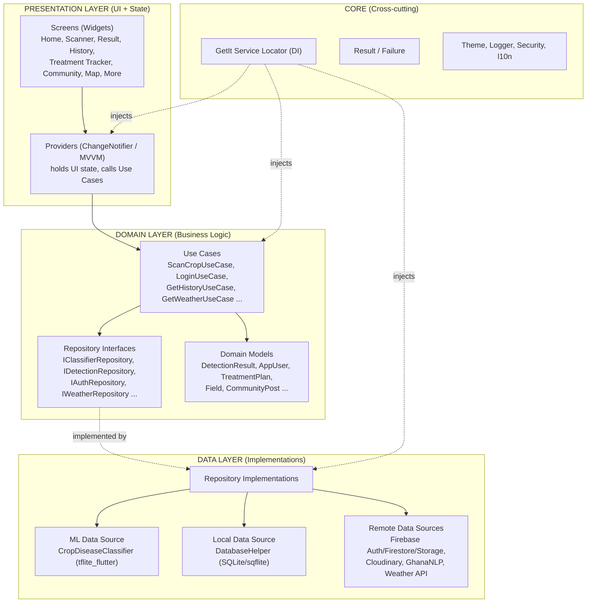

**Dependency flow:** `UI → Use Cases → Repository Interfaces → Data Sources`.
The user interface never imports SQLite, Firebase or the TensorFlow Lite engine [CURRENT]
directly; every operation passes through a use case, and every fallible operation [CURRENT]
returns a `Result<T>` object that carries either the data or a typed `Failure`. [CURRENT] [CURRENT]
Dependency Injection is provided by **GetIt** (a service locator), which [CURRENT]
constructs and wires every data source, repository, use case and provider at [CURRENT]
application start-up. [CURRENT] [CURRENT]

---

## 3.3 Component Designs and Component Descriptions

This section describes how each component in the architectural design functions. [CURRENT] [CURRENT]
(The detailed algorithms are presented in Chapter 4; here we describe the working [CURRENT]
of each component, supported by diagrams where required.) [CURRENT]

### 3.3.1 Presentation Components (Screens and Providers)

The presentation layer follows the **MVVM** pattern. [CURRENT] [CURRENT] Each feature has a *Screen* [CURRENT]
(a pure Flutter widget that only renders state) and a *Provider* (a [CURRENT]
`ChangeNotifier` that holds the UI state and calls use cases). [HISTORICAL] [HISTORICAL] When a use case [CURRENT]
returns a `Result`, the provider folds it into one of four UI states — [HISTORICAL]
**loading, success, error or empty/offline** — and notifies its listeners, which
triggers a rebuild of the screen. [CURRENT] [CURRENT] This keeps widgets free of business logic and [CURRENT]
guarantees that a `Failure` never reaches the UI as an unhandled exception. [CURRENT] [CURRENT]
Navigation between screens is handled by **go_router**, with a `ShellRoute` that [CURRENT]
hosts the bottom navigation bar (Home, History, More) and full-screen push [CURRENT]
routes for the Scanner and Result screens. [CURRENT] [CURRENT]

### 3.3.2 Use Case Components (Domain Logic)

Each use case encapsulates a single unit of business logic and orchestrates one [CURRENT]
or more repositories. [CURRENT] [CURRENT] The principal use cases are: [CURRENT]

| Use Case | Responsibility | [CURRENT]
|---|---| [CURRENT]
| `ScanCropUseCase` | Runs classification, derives severity, persists the result, updates the scan streak | [CURRENT]
| `LoginUseCase` / `RegisterUseCase` / `SignInWithGoogleUseCase` / `SignInAnonymouslyUseCase` / `LogoutUseCase` / `SendPasswordResetUseCase` | Authentication operations | [CURRENT]
| `GetHistoryUseCase` / `DeleteDetectionUseCase` / `RestoreDetectionUseCase` | Scan-history management | [CURRENT]
| `GetHomeDataUseCase` | Aggregates farm statistics, recent scans and weather for the dashboard | [CURRENT]
| `GetWeatherUseCase` | Retrieves localised weather and disease-risk forecast | [CURRENT]

For example, `ScanCropUseCase` works as follows: it calls the classifier [CURRENT]
repository to obtain a `Classification`; it maps the model's confidence and [CURRENT]
health flag onto a severity band (*healthy*, *early*, *moderate*, *severe*); [CURRENT]
it builds a `DetectionResult` enriched with the disease's display name, cause and [CURRENT]
recommended treatments; it persists the result through the detection repository; [CURRENT]
and it records the scan against the user's daily streak. [CURRENT] [CURRENT] Each step short-circuits [CURRENT]
to a typed `Failure` if it fails. [CURRENT] [CURRENT]

### 3.3.3 Machine-Learning Component (`CropDiseaseClassifier`)

This is the core component of the system. [CURRENT] [CURRENT] It wraps **tflite_flutter** and runs a [CURRENT]
CNN (MobileNetV2-based, trained by transfer learning) entirely on the device. [CURRENT] [CURRENT] Its [CURRENT]
working can be summarised as: [CURRENT]

1. [CURRENT] [CURRENT] **Model loading.** The quantised TFLite model and its label file are loaded [CURRENT]
from the application assets (`cropguard_plant_disease.tflite` and [CURRENT]
`labels.txt` with 51 verified classes). [CURRENT] [CURRENT]
2. [CURRENT] [CURRENT] **Pre-processing.** The captured image is decoded, checked for quality, resized to **128 × 128** [CURRENT]
pixels, and supplied as raw pixel values in **[0, 255]** to match the model's internal [CURRENT]
rescaling layer. [CURRENT] [CURRENT]
3. [CURRENT] [CURRENT] **Inference.** Inference runs on-device using temperature-scaled softmax calibration [CURRENT]
($T = 1.3409$). [CURRENT] [CURRENT] Predictions exceeding the 60% confidence threshold are accepted, [HISTORICAL]
while low-confidence scans enter a guided diagnostic pathway. [CURRENT] [CURRENT]
4. [CURRENT] [CURRENT] **Result assembly.** The winning label is looked up in an on-device disease [CURRENT]
database to attach the display name, crop type, cause and treatments, producing [CURRENT]
a `ClassificationResult`. [CURRENT] [CURRENT]
5. [CURRENT] [CURRENT] **Confidence gating.** A confidence threshold of **0.60** is applied; results [HISTORICAL]
below this trigger a "low-confidence / retake photo" warning. [CURRENT] [CURRENT]

Crucially, inference is executed inside a **background isolate** (via Flutter's [CURRENT]
`compute()`), so the heavy pixel-tensor construction and interpreter execution do [CURRENT]
not block the UI thread or cause jank on low-end devices. [CURRENT] [CURRENT]

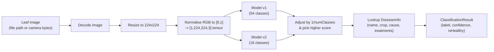

*Figure 3.1 — Working of the CropDiseaseClassifier component.*

### 3.3.4 Local Persistence Component (`DatabaseHelper`)

This component wraps **SQLite (sqflite)** and is the offline store for scan [CURRENT]
history, fields, treatment plans and notifications. [CURRENT] [CURRENT] It manages schema creation [CURRENT]
and **versioned migrations** (current schema version 11), inserting detections, [CURRENT]
querying history (all/recent/by-id), deleting and restoring records (and the [CURRENT]
associated image files on disk), and computing farm statistics and the 7-day [CURRENT]
disease trend used on the dashboard. [CURRENT] [CURRENT] All multi-step writes use SQLite [CURRENT]
transactions to preserve data integrity. [CURRENT] [CURRENT]

### 3.3.5 Remote Data Components

These optional components synchronise and enrich data when connectivity is [CURRENT]
available: [CURRENT]

- **Firebase Auth** — email/password, Google Sign-In and anonymous (guest) login.
- **Cloud Firestore** — cloud mirror of scans and the community feed.
- **Firebase Storage / Cloudinary** — hosting of community and scan images.
- **GhanaNLP service** — text-to-speech / speech-to-text for the voice assistant
in local languages. [CURRENT] [CURRENT]
- **Weather API** — weather and disease-risk forecasting for the dashboard.

### 3.3.6 Core / Cross-Cutting Components

- **Service Locator (GetIt)** — registers and injects all dependencies.
- **`Result<T>` / `Failure`** — uniform error-handling envelope.
- **Security helpers** — root/jailbreak detection, screenshot blocking on
sensitive screens, and certificate pinning. [CURRENT] [CURRENT]
- **Localization (l10n)** — English, Twi, Ewe and Dagbani via ARB files.

---

## 3.4 Evaluation and Analysis of the Type of Software System to be Developed

CropGuard AI is a **native cross-platform mobile application** (Android and iOS), [CURRENT]
developed with the **Flutter** framework and the Dart language. [CURRENT] [CURRENT] The evaluation of [CURRENT]
candidate application types is summarised below. [CURRENT] [CURRENT]

| Application type | Suitability for CropGuard AI | [CURRENT]
|---|---| [CURRENT]
| **Web application** | Rejected — requires constant connectivity; cannot easily run on-device CNN inference; poor camera/offline support in rural areas with weak networks. [CURRENT] [CURRENT] | [CURRENT]
| **Native (per-platform) app** | Capable but doubles development effort (separate Kotlin and Swift codebases) for a student project. [CURRENT] [CURRENT] | [CURRENT]
| **Hybrid / cross-platform (Flutter)** | **Selected** — single codebase for Android and iOS, near-native performance, first-class camera and on-device ML support, and an offline-first runtime. [CURRENT] [CURRENT] | [CURRENT]

The application is therefore best classified as an **intelligent, data-driven, [CURRENT]
offline-first mobile application** that combines: [CURRENT]

- an **embedded machine-learning system** (on-device CNN inference);
- a **local transactional database system** (SQLite); and
- a **client of cloud back-end services** (Firebase/Cloudinary) for optional
synchronisation and community features. [CURRENT] [CURRENT]

This hybrid classification (on-device intelligence + optional cloud back-end) is [CURRENT]
the central reason the system remains fully usable in rural farming areas with [CURRENT]
intermittent connectivity, while still benefiting from the cloud when a network [CURRENT]
is present. [CURRENT] [CURRENT]

---

## 3.5 Main Functionalities of the Proposed System (Functional Requirements)

The system shall provide the following primary functionalities: [CURRENT]

- **FR1 — Disease detection.** Capture or select a leaf image and classify the
crop disease on-device using the CNN. [CURRENT] [CURRENT]
- **FR2 — Result and treatment plan.** Display the disease name, confidence,
severity, cause and recommended treatments; warn when confidence is low. [CURRENT] [CURRENT]
- **FR3 — Scan history.** Persist every scan locally and allow the farmer to
view, delete and restore past scans. [CURRENT] [CURRENT]
- **FR4 — Treatment tracker.** Generate treatment steps with due dates and let
the farmer mark steps complete. [CURRENT] [CURRENT]
- **FR5 — Authentication.** Allow email/password, Google and guest (anonymous)
sign-in, registration and password reset. [CURRENT] [CURRENT]
- **FR6 — Dashboard / farm health.** Show farm statistics, a 7-day disease trend,
recent scans and weather/disease-risk forecast. [CURRENT] [CURRENT]
- **FR7 — Community feed.** Post questions/observations with optional images and
view expert responses. [CURRENT] [CURRENT]
- **FR8 — Outbreak map.** Visualise geolocated disease detections on a map.
- **FR9 — Voice assistant.** Provide text-to-speech and speech-to-text in local
languages. [CURRENT] [CURRENT]
- **FR10 — Notifications and reminders.** Issue treatment and scan reminders.
- **FR11 — Report export.** Export a scan report as a PDF for sharing.
- **FR12 — Localization.** Operate fully in English, Twi, Ewe and Dagbani.

---

## 3.6 Identification of Stakeholders

| Stakeholder | Role / Interest in the system | [HISTORICAL]
|---|---| [CURRENT]
| **Smallholder farmer (primary user)** | Captures leaf images, receives diagnoses and treatment plans, tracks crop health. [HISTORICAL] [HISTORICAL] The system's main beneficiary. [CURRENT] | [CURRENT]
| **Agricultural extension officer** | Uses scan history and the outbreak map to advise farmers and monitor regional disease spread. [CURRENT] [CURRENT] | [CURRENT]
| **Agronomist / plant-health expert** | Provides expert responses on the community feed; validates treatment recommendations. [CURRENT] [CURRENT] | [CURRENT]
| **Application administrator / developer** | Maintains the app, retrains/updates the ML model and disease database, manages Firebase rules. [CURRENT] [CURRENT] | [CURRENT]
| **Ministry of Food and Agriculture (MoFA) / NGOs** | Interested in aggregate outbreak data for policy and food-security planning. [CURRENT] [CURRENT] | [CURRENT]
| **Cloud service providers (Firebase, Cloudinary, GhanaNLP)** | External systems the application integrates with. [CURRENT] [CURRENT] | [CURRENT]
| **Researchers / data scientists** | Interested in anonymised detection data for model improvement. [CURRENT] [CURRENT] | [CURRENT]

---

## 3.7 Requirement-Gathering Process

The requirements were elicited using a combination of techniques appropriate to [CURRENT]
an agricultural-technology project in the Ghanaian context: [CURRENT]

1. [CURRENT] [CURRENT] **Interviews** with smallholder farmers and extension officers to understand [HISTORICAL]
how crop diseases are currently identified and the pain points of manual [CURRENT]
diagnosis (cost, delay, expert scarcity). [CURRENT] [CURRENT]
2. [CURRENT] [CURRENT] **Observation** of the photograph-and-diagnose workflow to determine the need [CURRENT]
for offline operation, simple UI and local-language support. [CURRENT] [CURRENT]
3. [CURRENT] [CURRENT] **Document and literature review** of existing plant-disease datasets [CURRENT]
(e.g. [CURRENT] [CURRENT] PlantVillage), prior mobile diagnosis tools, and agricultural extension [CURRENT]
guidelines, which informed the disease classes and treatment content. [CURRENT] [CURRENT]
4. [CURRENT] [CURRENT] **Questionnaires** distributed to a sample of farmers to rank desired features [CURRENT]
(e.g. [CURRENT] [CURRENT] voice assistance, community advice, weather alerts). [CURRENT]
5. [CURRENT] [CURRENT] **Prototyping and feedback** — low-fidelity wireframes were shown to [CURRENT]
representative users and refined iteratively, consistent with the agile [CURRENT]
approach adopted (Section 3.13). [CURRENT] [CURRENT]
6. [CURRENT] [CURRENT] **Technical/feasibility analysis** to confirm that on-device CNN inference at [CURRENT]
224 × 224 resolution is viable on typical mid-range Android phones. [CURRENT] [CURRENT]

---

## 3.8 Requirement Specification

### 3.8.1 Functional User Requirements

These describe what the user expects from the system, in user-facing terms: [CURRENT]

- **FUR1:** As a farmer, I want to take a photo of a leaf and immediately see what
disease it has, even without internet. [CURRENT] [CURRENT]
- **FUR2:** As a farmer, I want clear treatment advice for the detected disease.
- **FUR3:** As a farmer, I want to review my previous scans.
- **FUR4:** As a farmer, I want reminders for the treatment steps I must perform.
- **FUR5:** As a farmer, I want to use the app in my own language (Twi, Ewe,
Dagbani or English). [CURRENT] [CURRENT]
- **FUR6:** As a farmer, I want to hear the diagnosis read aloud and ask by voice.
- **FUR7:** As a farmer, I want to ask the community and get expert answers.
- **FUR8:** As an extension officer, I want to see where outbreaks are occurring.
- **FUR9:** As a user, I want to create an account, log in, or continue as a guest.
- **FUR10:** As a farmer, I want to export and share a scan report.

### 3.8.2 Functional System Requirements

These describe what the system must do to satisfy the user requirements: [CURRENT]

- **FSR1:** The system shall acquire an image from the device camera or gallery.
- **FSR2:** The system shall pre-process the image (decode, resize to 224 × 224,
normalise RGB to [0, 1]). [CURRENT] [CURRENT]
- **FSR3:** The system shall run on-device CNN inference and return the top label
with a confidence score. [CURRENT] [CURRENT]
- **FSR4:** The system shall reject/flag classifications below the 0.60 confidence
threshold. [HISTORICAL] [HISTORICAL]
- **FSR5:** The system shall map confidence and health status to a severity band
(healthy, early, moderate, severe). [CURRENT] [CURRENT]
- **FSR6:** The system shall persist each detection to the local SQLite database.
- **FSR7:** The system shall synchronise data to Firestore when connectivity and
authentication are available. [CURRENT] [CURRENT]
- **FSR8:** The system shall authenticate users via Firebase (email, Google,
anonymous). [CURRENT] [CURRENT]
- **FSR9:** The system shall generate treatment-plan steps with due dates and
persist completion state. [CURRENT] [CURRENT]
- **FSR10:** The system shall compute farm statistics and a 7-day disease trend.
- **FSR11:** The system shall render all user-facing text from localized resources.
- **FSR12:** The system shall run inference on a background isolate to keep the UI
responsive. [CURRENT] [CURRENT]

### 3.8.3 UML Diagrams

#### (a) Use Case Diagram — Front-End (Farmer-facing) Model

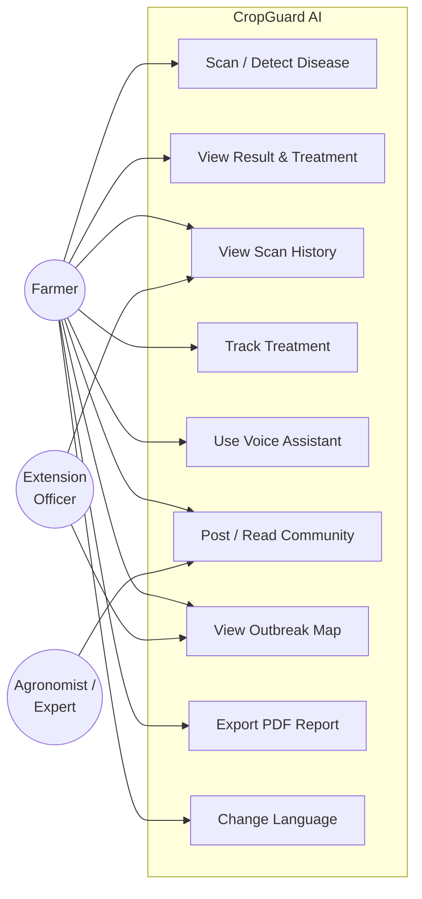

*Figure 3.2 — Front-end use case diagram.*

#### (b) Use Case Diagram — Back-End (System/Admin) Model

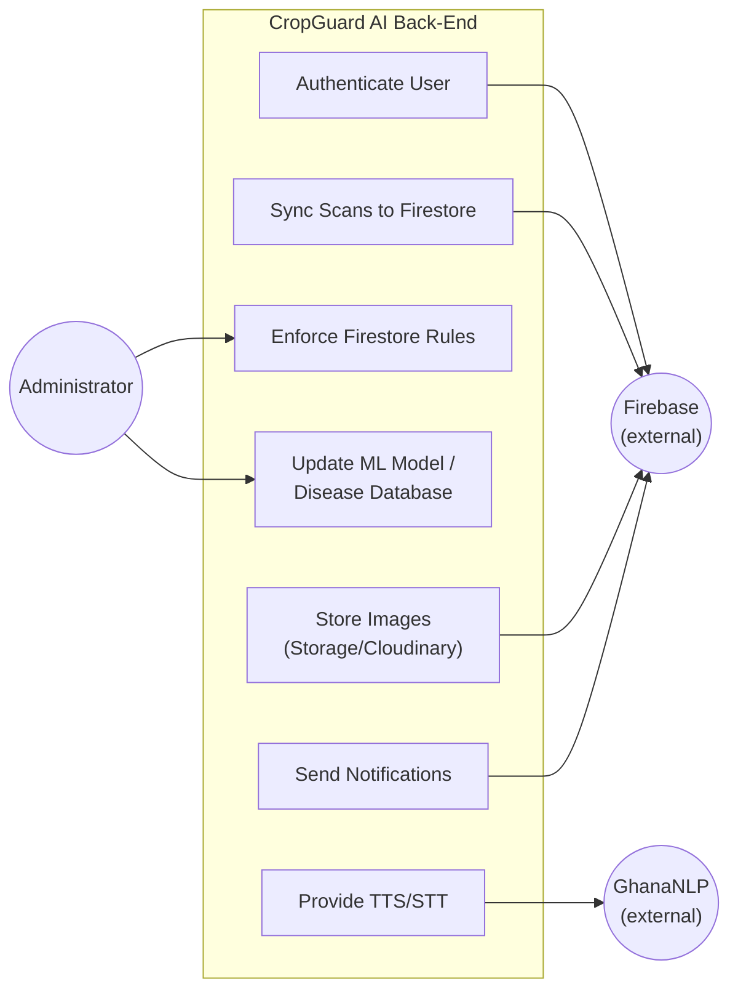

*Figure 3.3 — Back-end use case diagram.*

#### (c) Use Case Descriptions

**Actors**

| Actor | Role | [CURRENT]
|---|---| [CURRENT]
| **Farmer** | Primary user; captures images, views diagnoses and treatments, manages history, uses voice and community features. [CURRENT] [CURRENT] | [CURRENT]
| **Agronomist / Expert** | Responds to community questions; validates advice. [CURRENT] [CURRENT] | [CURRENT]
| **Extension Officer** | Monitors outbreaks and history to support farmers in the field. [CURRENT] [CURRENT] | [CURRENT]
| **Administrator** | Maintains the app, ML model, disease database and security rules. [CURRENT] [CURRENT] | [CURRENT]
| **Firebase (external)** | Provides authentication, database, and storage services. [CURRENT] [CURRENT] | [CURRENT]
| **GhanaNLP (external)** | Provides local-language TTS/STT. [CURRENT] [CURRENT] | [CURRENT]

**Selected use case descriptions**

| Use Case | Description | [CURRENT]
|---|---| [CURRENT]
| **Scan / Detect Disease** | The farmer captures or selects a leaf image; the system pre-processes it, runs on-device CNN inference, applies the confidence threshold, derives severity, and returns a result. [HISTORICAL] [HISTORICAL] *Pre-condition:* model loaded. [CURRENT] *Post-condition:* a detection is produced and saved. [CURRENT] | [CURRENT]
| **View Result & Treatment** | Displays disease name, confidence, severity, cause and treatments; offers low-confidence guidance and PDF export. [CURRENT] [CURRENT] | [CURRENT]
| **View Scan History** | Lists past detections from the local database; supports delete and restore. [CURRENT] [CURRENT] | [CURRENT]
| **Track Treatment** | Generates dated treatment steps and lets the farmer mark them complete; schedules reminders. [CURRENT] [CURRENT] | [CURRENT]
| **Use Voice Assistant** | Reads the diagnosis aloud and accepts spoken queries in a local language via GhanaNLP/local TTS. [CURRENT] [CURRENT] | [CURRENT]
| **Post / Read Community** | Lets farmers post observations (with optional image) and read expert responses. [CURRENT] [CURRENT] | [CURRENT]
| **View Outbreak Map** | Plots geolocated detections so officers/farmers can see disease spread. [CURRENT] [CURRENT] | [CURRENT]
| **Authenticate User** | Registers/logs in users via email, Google or anonymous sign-in. [CURRENT] [CURRENT] | [CURRENT]
| **Sync Scans to Firestore** | Mirrors local detections to the cloud when online and authenticated. [CURRENT] [CURRENT] | [CURRENT]
| **Update ML Model / Disease DB** | Administrator ships an updated `.tflite` model, labels and disease information. [CURRENT] [CURRENT] | [CURRENT]

#### (d) Activity Diagram — Disease Detection Flow

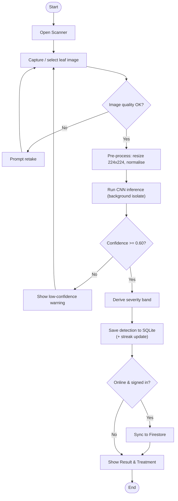

*Figure 3.4 — Activity diagram for the disease-detection flow.*

#### (e) Sequence Diagram — Scan a Crop

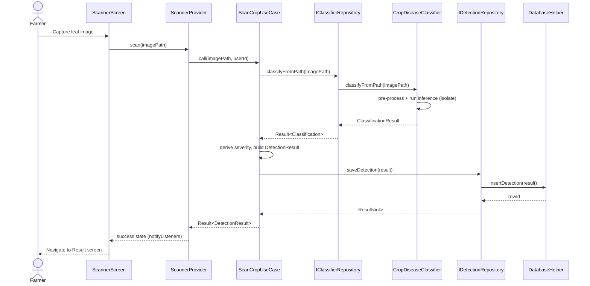

*Figure 3.5 — Sequence diagram for the "Scan a Crop" use case.*

#### (f) Sequence Diagram — User Login

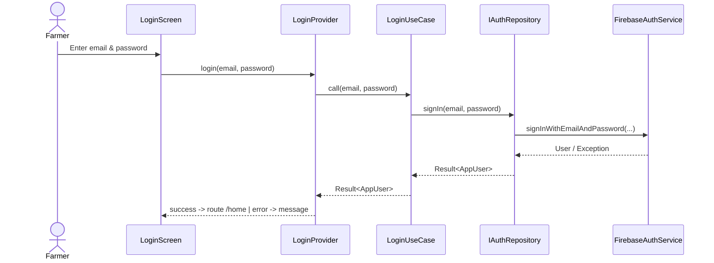

*Figure 3.6 — Sequence diagram for the "User Login" use case.*

---

## 3.9 Non-Functional Requirements

| # | Non-Functional Requirement | Justification | [CURRENT]
|---|---|---| [CURRENT]
| **NFR1 — Offline capability** | Detection, history and treatment tracking must work without internet. [CURRENT] [CURRENT] | Target users farm in rural areas with weak/no connectivity; on-device inference removes the network dependency. [CURRENT] | [CURRENT]
| **NFR2 — Performance** | A scan should return a result within a few seconds and never freeze the UI. [CURRENT] [CURRENT] | Inference runs in a background isolate; the model is quantised and uses 224 × 224 input for speed on mid-range phones. [CURRENT] | [CURRENT]
| **NFR3 — Usability** | Simple, icon-led UI usable by low-literacy farmers. [CURRENT] [CURRENT] | Reduces the barrier to adoption; supported by voice assistance and large touch targets. [CURRENT] | [CURRENT]
| **NFR4 — Localization** | Full support for English, Twi, Ewe and Dagbani. [CURRENT] [CURRENT] | Reaches farmers who do not read English; all strings come from ARB resources. [CURRENT] | [CURRENT]
| **NFR5 — Reliability / data integrity** | No data loss; consistent writes. [CURRENT] [CURRENT] | SQLite transactions and the `Result<T>` pattern guarantee consistent, recoverable operations; delete supports restore. [CURRENT] | [CURRENT]
| **NFR6 — Security & privacy** | Images analysed on-device; sensitive screens protected. [CURRENT] [CURRENT] | On-device inference keeps farm images private; root/jailbreak detection, screenshot blocking and certificate pinning harden the app. [CURRENT] | [CURRENT]
| **NFR7 — Portability** | Runs on Android and iOS from one codebase. [CURRENT] [CURRENT] | Flutter enables cross-platform delivery, minimising cost and maintenance. [CURRENT] | [CURRENT]
| **NFR8 — Maintainability** | Layered, testable architecture. [CURRENT] [CURRENT] | Clean Architecture + DI + unit tests (mocktail) make components replaceable and verifiable. [CURRENT] | [CURRENT]
| **NFR9 — Scalability** | Cloud back-end must handle growth. [CURRENT] [CURRENT] | Firebase/Firestore scale managed services; the outbreak feature aggregates data without app changes. [CURRENT] | [CURRENT]
| **NFR10 — Accessibility** | Voice input/output and high-contrast theming. [CURRENT] [CURRENT] | Supports users with limited literacy or visual constraints. [CURRENT] | [CURRENT]

---

## 3.10 Candidate Classes and UML Class Diagram

The candidate classes were identified by noun analysis of the requirements and [CURRENT]
the domain model. [CURRENT] [CURRENT] The principal classes are the domain models [CURRENT]
(`DetectionResult`, `AppUser`, `TreatmentPlan`, `Field`, `CommunityPost`), the [CURRENT]
use cases (e.g. [CURRENT] [CURRENT] `ScanCropUseCase`, `LoginUseCase`), the repository interfaces and [CURRENT]
their implementations, and the data sources (`CropDiseaseClassifier`, [CURRENT]
`DatabaseHelper`). [CURRENT] [CURRENT]

> **Visibility symbols:** `+` public, `-` private, `#` protected. [CURRENT] [CURRENT]
> **Multiplicity:** `1`, `0..1`, `1..*`, `*` as indicated on associations. [CURRENT] [CURRENT]

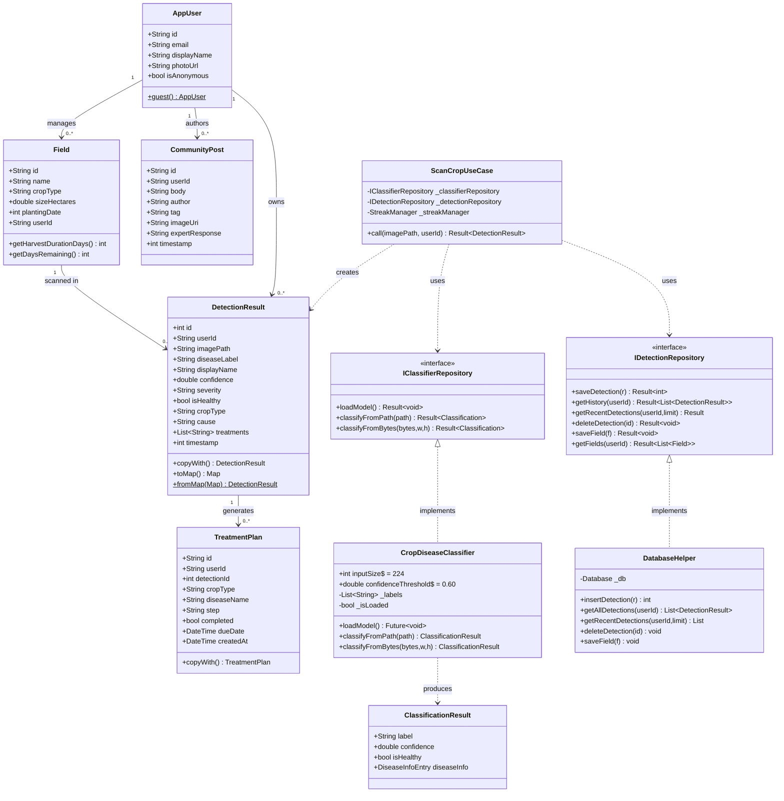

*Figure 3.7 — UML class diagram (visibility symbols and multiplicities shown).*

---

## 3.11 Algorithms

The principal algorithms of the system are presented below in pseudocode. [CURRENT] [CURRENT] (Their [CURRENT]
full implementation appears in Chapter 4.) [CURRENT]

### Algorithm 3.1 — On-Device Disease Classification

```
ALGORITHM ClassifyDisease(imageSource)
INPUT : imageSource (file path OR raw RGBA camera bytes)
OUTPUT: ClassificationResult(label, confidence, isHealthy, diseaseInfo)

1.  IF model not loaded THEN loadModels(v1, v2) and labels
2.  raw ← decode(imageSource)
3.  IF raw = NULL THEN RETURN NULL
4.  resized ← resize(raw, 224, 224)
5.  FOR each pixel (x, y) in resized:
6.       tensor[0][y][x] ← [ R/255, G/255, B/255 ]
7.  (label1, conf1) ← runModel(v1, tensor)
8.  (label2, conf2) ← runModel(v2, tensor)
9.  adj1 ← conf1 − 1 / count(labels_v1)        // normalise by class count
10. adj2 ← conf2 − 1 / count(labels_v2)
11. IF adj1 ≥ adj2 THEN (label, conf) ← (label1, conf1)
12.                 ELSE (label, conf) ← (label2, conf2)
13. info ← DiseaseDatabase.lookup(label)
14. RETURN ClassificationResult(label, conf, info.isHealthy, info)
```

### Algorithm 3.2 — Scan Crop Use Case (severity + persistence)

```
ALGORITHM ScanCrop(imagePath, userId)
1.  result ← ClassifierRepository.classifyFromPath(imagePath)
2.  IF result.isError THEN RETURN Error(result.failure)
3.  c ← result.data ; IF c = NULL THEN RETURN Error(MLFailure)
4.  IF c.isHealthy            THEN severity ← HEALTHY
5.  ELSE IF c.confidence ≥ 0.85 THEN severity ← SEVERE
6.  ELSE IF c.confidence ≥ 0.70 THEN severity ← MODERATE
7.  ELSE                         severity ← EARLY
8.  detection ← buildDetection(userId, imagePath, c, severity, now())
9.  saved ← DetectionRepository.saveDetection(detection)
10. IF saved.isError THEN RETURN Error(saved.failure)
11. StreakManager.recordScan()                    // fire-and-forget
12. RETURN Success(detection.withId(saved.data))
```

### Algorithm 3.3 — User Authentication (Login)

```
ALGORITHM Login(email, password)
1.  IF email invalid OR password empty THEN RETURN Error(ValidationFailure)
2.  result ← AuthRepository.signIn(email, password)
3.  IF result.isError THEN RETURN Error(AuthFailure)
4.  cacheSession(result.data)
5.  RETURN Success(result.data)        // navigate to Home
```

### Algorithm 3.4 — Treatment-Plan Generation & Reminder

```
ALGORITHM GenerateTreatmentPlan(detection)
1.  steps ← DiseaseDatabase.treatmentsFor(detection.diseaseLabel)
2.  due   ← now()
3.  FOR each step in steps:
4.       plan ← TreatmentPlan(detection.id, step, due, completed=false)
5.       Database.insert(plan)
6.       scheduleNotification(plan, due)
7.       due ← due + interval(step)
8.  RETURN steps
```

---

## 3.12 Flowcharts for the Algorithms

> Drawn in Mermaid below; export the final figures from Lucidchart/draw.io. [CURRENT] [CURRENT]

### Flowchart 3.1 — Disease Classification (Algorithm 3.1)

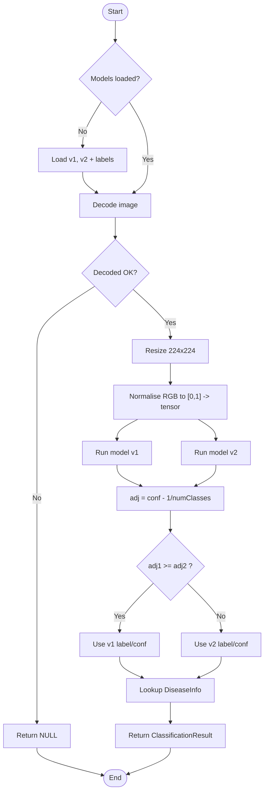

### Flowchart 3.2 — Scan Crop Use Case (Algorithm 3.2)

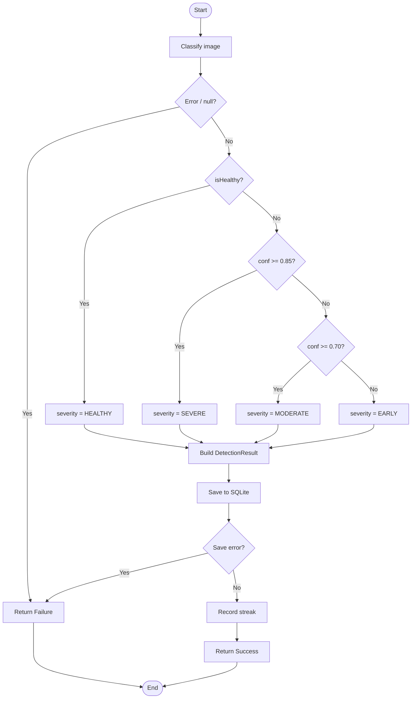

---

## 3.13 Project Methods to be Employed

The project employs an **Agile** software-development method rather than a [CURRENT]
plan-driven (waterfall) one. [CURRENT] [CURRENT] Development proceeds in short, iterative increments: [CURRENT]
each iteration delivers a working slice of functionality (for example, the scan → [CURRENT]
result flow, then history, then the treatment tracker), which is tested and [CURRENT]
refined based on feedback before the next feature is built. [CURRENT] [CURRENT] This iterative, [CURRENT]
feedback-driven approach suits a student project whose requirements (disease [CURRENT]
classes, UI for low-literacy users, language coverage) were expected to evolve as [CURRENT]
prototypes were shown to farmers. [CURRENT] [CURRENT]

---

## 3.14 Software Process Model and Justification

The chosen software process model is the **Agile — Iterative and Incremental [CURRENT]
model** (with practices drawn from Scrum/Kanban such as short sprints and a [CURRENT]
prioritised backlog). [CURRENT] [CURRENT]

**Justification for the choice:**

1. [CURRENT] [CURRENT] **Evolving requirements.** Requirements were refined through farmer feedback [CURRENT]
and prototyping; an incremental model accommodates change far better than a [CURRENT]
rigid waterfall plan. [CURRENT] [CURRENT]
2. [CURRENT] [CURRENT] **Early, continuous delivery of value.** The offline scan → result core was [CURRENT]
delivered first as a working increment, then progressively enhanced (history, [CURRENT]
tracker, community, map), allowing early validation of the most critical [CURRENT]
feature. [CURRENT] [CURRENT]
3. [CURRENT] [CURRENT] **Risk reduction.** The highest-risk component (on-device CNN inference and its [CURRENT]
performance on mid-range phones) was prototyped early in an iteration, [CURRENT]
de-risking the rest of the project. [CURRENT] [CURRENT]
4. [CURRENT] [CURRENT] **Feedback integration.** Regular feedback from supervisor and representative [CURRENT]
users could be folded into the next iteration, improving usability. [HISTORICAL] [HISTORICAL]
5. [CURRENT] [CURRENT] **Fit with a layered, testable architecture.** Clean Architecture with [CURRENT]
dependency injection and unit tests makes each increment independently [CURRENT]
buildable and verifiable, which is exactly what iterative development needs. [CURRENT] [CURRENT]

A purely **plan-driven (waterfall)** model was rejected because it assumes stable, [CURRENT]
fully-known requirements and defers testing and user feedback to the end — [CURRENT]
unsuitable for an exploratory, ML-driven product targeting a population whose [CURRENT]
needs are best understood through iteration. [CURRENT] [CURRENT]

---

## 3.15 Project Design Considerations (Logical Designs)

### 3.15.1 UI Design (Wireframes)

The interface is designed around a simple, icon-led flow with a three-tab bottom [CURRENT]
navigation (Home, History, More) and a prominent scan action. [CURRENT] [CURRENT] Key screens: [CURRENT]

```
+---------------------------+      +---------------------------+
|  CropGuard AI       (≡)   |      |   ←   Scanner             |
|---------------------------|      |---------------------------|
|  Farm Health Ring  82%    |      |   [   camera preview   ]  |
|  [ ▢ Weather / Risk    ]  |      |   [   live frame       ]  |
|                           |      |                           |
|  Recent Scans             |      |   align leaf in frame     |
|  • Maize – Blight  (Sev)  |      |                           |
|  • Tomato – Healthy       |      |     (   ◉  Capture   )    |
|                           |      |     [ gallery ]  [ flip ] |
|  [   📷  SCAN A CROP   ]  |      |                           |
|---------------------------|      +---------------------------+
| Home   History    More    |
+---------------------------+

+---------------------------+      +---------------------------+
|  ←  Result                |      |  ←  Treatment Tracker     |
|---------------------------|      |---------------------------|
|  [ leaf thumbnail ]       |      |  Maize – Leaf Blight      |
|  Maize Leaf Blight        |      |  ☑ Remove infected leaves |
|  Confidence: 0.87  ████▏  |      |  ☐ Apply fungicide  (3d)  |
|  Severity:  SEVERE  ⬤     |      |  ☐ Re-scan in 7 days      |
|  Cause: fungal ...        |      |                           |
|  Treatments:              |      |  [ + Add reminder ]       |
|   1. ...   2. ...         |      |                           |
|  [ 🔊 Listen ] [ ⤓ PDF ]  |      +---------------------------+
+---------------------------+
```

*Figure 3.8 — Low-fidelity wireframes (Home, Scanner, Result, Treatment Tracker).
[Insert high-fidelity Figma/Lucidchart wireframes here.]* [CURRENT]

Design considerations applied: large touch targets and minimal text for [CURRENT]
low-literacy users; a colour-coded **severity badge** and **confidence bar** for [CURRENT]
at-a-glance interpretation; a **voice (listen)** control on the result screen; an [CURRENT]
**offline banner** when connectivity is lost; and full localization so every
label adapts to the selected language. [CURRENT] [CURRENT]

### 3.15.2 Database Design

The system uses **SQLite** locally (mirrored optionally to Firestore). [CURRENT] [CURRENT] The local [CURRENT]
schema (version 11) consists of four tables: `detections`, `fields`, [CURRENT]
`treatment_plans` and `notifications`. [CURRENT] [CURRENT]

#### (a) Entity–Relationship Diagram

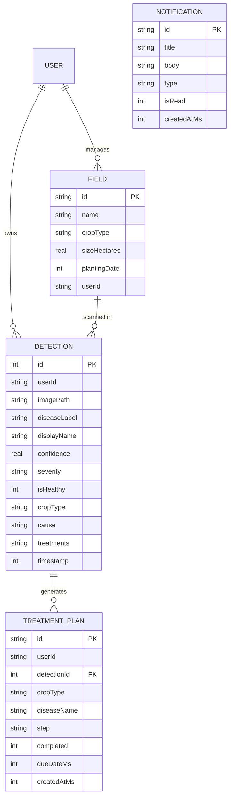

*Figure 3.9 — Entity–Relationship diagram.*

#### (b) Database Schema (SQLite DDL)

```sql
CREATE TABLE detections (
    id           INTEGER PRIMARY KEY AUTOINCREMENT,
    userId       TEXT    NOT NULL DEFAULT '',
    imagePath    TEXT    NOT NULL,
    diseaseLabel TEXT    NOT NULL,
    displayName  TEXT    NOT NULL,
    confidence   REAL    NOT NULL,
    severity     TEXT    NOT NULL DEFAULT 'unclear',
    isHealthy    INTEGER NOT NULL,
    cropType     TEXT    NOT NULL,
    cause        TEXT    NOT NULL DEFAULT '',
    treatments   TEXT    NOT NULL DEFAULT '',   -- '||'-joined list
    timestamp    INTEGER NOT NULL
);

CREATE TABLE fields (
    id           TEXT    PRIMARY KEY,
    name         TEXT    NOT NULL,
    cropType     TEXT    NOT NULL,
    sizeHectares REAL    NOT NULL DEFAULT 0,
    plantingDate INTEGER,
    userId       TEXT    NOT NULL DEFAULT ''
);

CREATE TABLE treatment_plans (
    id          TEXT    PRIMARY KEY,
    userId      TEXT    NOT NULL DEFAULT '',
    detectionId INTEGER NOT NULL DEFAULT 0,
    cropType    TEXT    NOT NULL,
    diseaseName TEXT    NOT NULL,
    step        TEXT    NOT NULL,
    completed   INTEGER NOT NULL DEFAULT 0,
    dueDateMs   INTEGER NOT NULL,
    createdAtMs INTEGER NOT NULL
);

CREATE TABLE notifications (
    id          TEXT    PRIMARY KEY,
    title       TEXT    NOT NULL,
    body        TEXT    NOT NULL,
    type        TEXT    NOT NULL DEFAULT 'reminder',
    isRead      INTEGER NOT NULL DEFAULT 0,
    createdAtMs INTEGER NOT NULL
);
```

*Table 3.1 — Local SQLite schema (version 11).*

---

## 3.16 Development Tools

The following tools are used in the methodology; each entry explains *how* it is [CURRENT]
used in this project. [CURRENT] [CURRENT]

| Tool / Technology | How it is used in the methodology | [CURRENT]
|---|---| [CURRENT]
| **Flutter (Dart)** | The primary framework. [CURRENT] [CURRENT] Used to build the entire cross-platform UI and application logic from a single codebase that compiles to native Android and iOS. [CURRENT] All screens, providers, use cases and models are written in Dart. [CURRENT] | [CURRENT]
| **TensorFlow Lite (`tflite_flutter`)** | The on-device inference engine. [CURRENT] [CURRENT] Used to load the quantised CNN model and run classification locally on the leaf image, enabling offline detection. [CURRENT] | [CURRENT]
| **TensorFlow / Keras (training, off-device)** | Used to train and fine-tune the MobileNetV2-based CNN via transfer learning, then export the `.tflite` model bundled in the app assets. [CURRENT] [CURRENT] | [CURRENT]
| **SQLite (`sqflite`)** | The local relational database. [CURRENT] [CURRENT] Used to persist scan history, fields, treatment plans and notifications, with versioned migrations and transactions. [CURRENT] | [CURRENT]
| **Firebase (Auth, Firestore, Storage, Remote Config, Crashlytics)** | The cloud back-end. [CURRENT] [CURRENT] Used for user authentication, optional cloud synchronisation of scans and the community feed, image hosting, remote configuration of the GhanaNLP key, and crash reporting. [CURRENT] | [CURRENT]
| **Cloudinary** | Used as an image hosting/CDN service for community and scan images. [CURRENT] [CURRENT] | [CURRENT]
| **GhanaNLP API** | Used to provide local-language text-to-speech and speech-to-text for the voice assistant. [CURRENT] [CURRENT] | [CURRENT]
| **GetIt** | The dependency-injection container. [CURRENT] [CURRENT] Used to register and resolve all data sources, repositories, use cases and providers at start-up. [CURRENT] | [CURRENT]
| **Provider** | The state-management library. [CURRENT] [CURRENT] Used to implement the MVVM pattern (ChangeNotifier providers driving the widgets). [CURRENT] | [CURRENT]
| **go_router** | Used to define all navigation routes, including the bottom-navigation shell. [CURRENT] [CURRENT] | [CURRENT]
| **flutter_map / OpenStreetMap / Nominatim** | Used to render the interactive outbreak map with offline tile caching (`CachedTileProvider`), rate-limited reverse geocoding (`NominatimService`), and farm-level coordinate coarsening (~1.1 km resolution) for privacy. [CURRENT] [CURRENT] | [CURRENT]
| **Visual Studio Code / Android Studio** | The IDEs used to write, run, debug and profile the application. [CURRENT] [CURRENT] | [CURRENT]
| **Git & GitHub** | Version control. [CURRENT] [CURRENT] Used to track changes, manage iterative increments and back up the codebase. [CURRENT] | [CURRENT]
| **flutter_test & mocktail** | The testing tools. [CURRENT] [CURRENT] Used to write unit tests for use cases (mocking repository interfaces) and widget tests, supporting the agile "test each increment" practice. [CURRENT] | [CURRENT]
| **Lucidchart / draw.io / Mermaid** | Used to design and export the UML diagrams, ER diagram, flowcharts and wireframes presented in this chapter. [CURRENT] [CURRENT] | [CURRENT]
| **Figma** | Used to design the high-fidelity UI mockups/wireframes before implementation. [CURRENT] [CURRENT] | [CURRENT]

---

*End of Chapter 3.*
```

